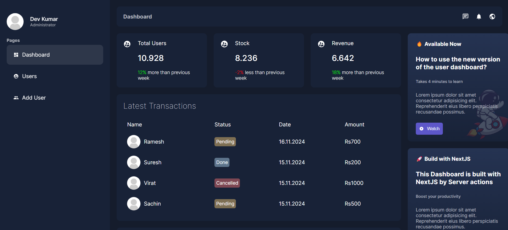
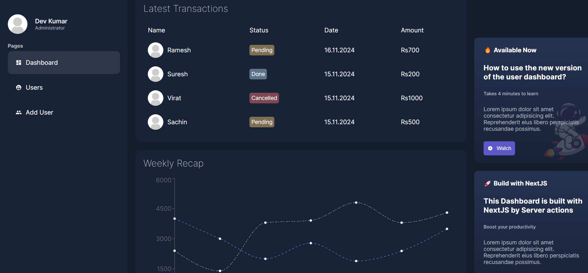

# User Dashboard

This is repository for User dashboard project 

Here's the [Live Project](https://user-dashboard-chi.vercel.app/dashboard) deployed on Vercel






## Project Set up 

1. Clone the repository into your local environment

```bash
git clone https://github.com/DevDK12/user-dashboard.git
```


2. Install pacakges and dependencies
```bash
npm i
```

3. Create `.env` file in root directory of project (outside of any folder side by side of `package.json` file)
   - Replace `<mongodb uri>` with your unique mongodb url 
   - Follow next section to generate url

`.env` file
```bash
MONGO=<mongodb uri>
```


4. Build optimal version of project and run :
```bash
npm build
npm start
```


5. To run development server (`OPTIONAL`  only for development purposes ) : 
```bash
nmp run dev
```

Open [http://localhost:3000](http://localhost:3000) with your browser to see the result.


## Mongodb Configuration 
- Go to [Mongodb](mongodb.com) and signup and login 
- On top left of Navbar under  `Logo` click on it  then  `Create new project`
- Name your project and set up your project
- In sidebar , under `SECURITY` click on `Network Access` , click `Add IP Address` then `ALLOW ACCESS FROM ANYWHERE`
- In sidebar , under `DEPLOYMENT` click on `Database` , click `Connect` then select  `Mongodb for VS code`
- Copy the Unique connection url from there and paste in `.env` file 
- Don't forget to add your `password` in connection url


## Deploy on Vercel

The easiest way to deploy your Next.js app is to use the [Vercel Platform](https://vercel.com/new?utm_medium=default-template&filter=next.js&utm_source=create-next-app&utm_campaign=create-next-app-readme) from the creators of Next.js.

Check out our [Next.js deployment documentation](https://nextjs.org/docs/deployment) for more details.


